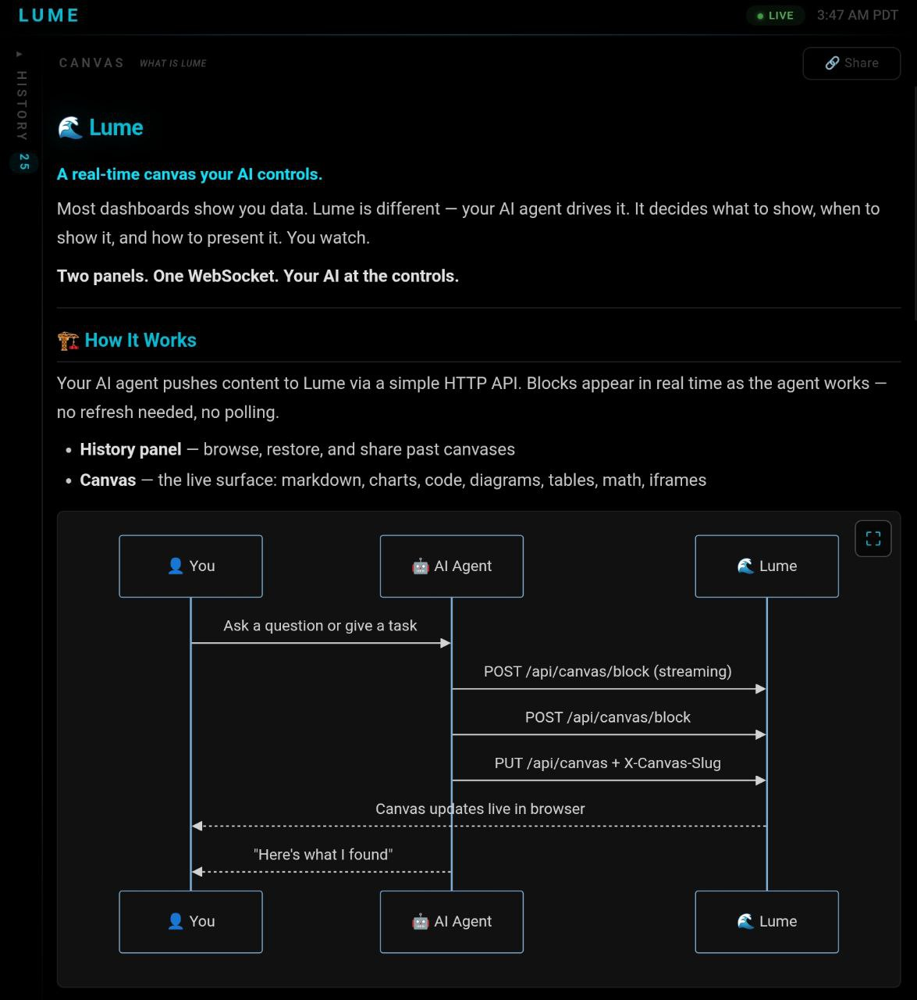
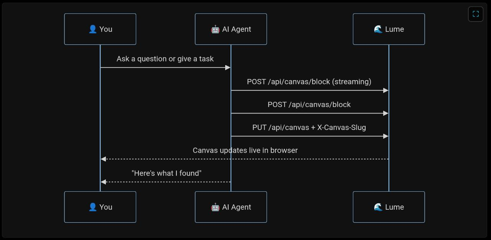
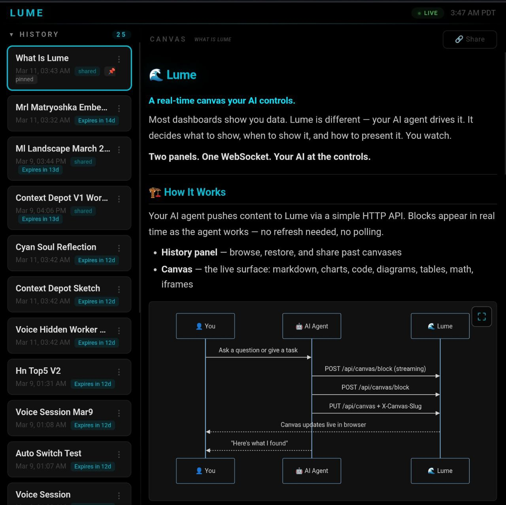
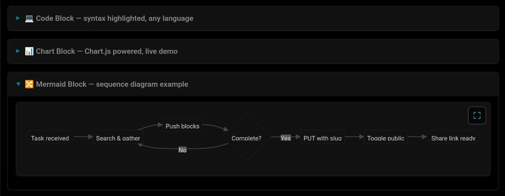
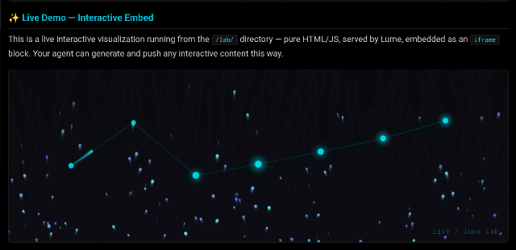

# Lume

**A real-time dashboard your AI controls.**

Most dashboards show you data. Lume is different — your AI agent drives it. It decides what to show, when to show it, and how to present it. You watch.

Two panels. One WebSocket. Your AI at the controls.

---

## What It Is

Lume is a lightweight Node.js server + vanilla JS frontend that exposes a REST API and WebSocket for an AI agent to push content in real time:

- **History** — a canvas snapshot browser. Load previous canvases, share them, pin or delete. Your working history, always accessible.
- **Canvas** — a rich, composable surface: markdown, charts, code, math, diagrams, images, interactive iframes

The key idea: **the AI writes to the dashboard, not the user.** Your agent decides what appears, streams it in block by block, and updates it as things change.


---

## Quick Start

### 1. Clone and install

```bash
git clone https://github.com/TwoDukes/Lume.git
cd Lume
npm install
```

### 2. Configure

```bash
cp .env.example .env
```

Edit `.env`:

```env
LUME_TOKEN=your-secret-token-here

# Dashboard login password (auto-generated and logged on first run if not set)
LUME_PASSWORD=your-dashboard-password

# Optional: OpenClaw gateway integration
OPENCLAW_GATEWAY_URL=http://127.0.0.1:18789
OPENCLAW_GATEWAY_TOKEN=your-gateway-token
```

### 3. Run

```bash
npm start
```

Open `http://localhost:7777` in your browser. Log in with your `LUME_PASSWORD`. Your session persists via a signed cookie — you won't need to log in again on restarts.

### 4. Connect your AI

Your agent pushes content via the REST API. No SDK needed — it's just HTTP.

```bash
# Push a canvas with identity (auto-saves to History)
curl -X PUT http://localhost:7777/api/canvas \
  -H "Authorization: Bearer your-token" \
  -H "Content-Type: application/json" \
  -H "X-Canvas-Slug: my-research" \
  -d '{"type":"blocks","blocks":[{"type":"markdown","content":"# My Research"}]}'

# Append a block progressively
curl -X POST http://localhost:7777/api/canvas/block \
  -H "Authorization: Bearer your-token" \
  -H "Content-Type: application/json" \
  -d '{"type":"markdown","content":"More content..."}'

# Push a toast notification
curl -X POST http://localhost:7777/api/toast \
  -H "Authorization: Bearer your-token" \
  -H "Content-Type: application/json" \
  -d '{"id":"hello","icon":"🔵","title":"Hello","body":"Lume is live."}'
```

---

| History closed | History open |
|---|---|
|  |  |

---

## Architecture

```
┌─────────────────────────────┐   Bearer token (REST + WebSocket)
│         AI Agent            │ ──────────────────────────────────→ Lume Server (Node.js)
│  (Claude, GPT, Gemini, etc) │                                             │
└─────────────────────────────┘                                     WebSocket broadcast
                                                                             │
                                             ┌───────────────────────────────┤
                                             ↓                               ↓
                                  ┌─────────────────────┐     ┌─────────────────────────┐
                                  │  Browser / Phone     │     │   Public Share Page      │
                                  │  (password login)    │     │   /share/:slug           │
                                  │  History │  Canvas    │     │   (no auth, read-only)   │
                                  └─────────────────────┘     └─────────────────────────┘
```

Lume is **model-agnostic**. Any agent that can make HTTP requests can drive it.



---

## API Reference

All endpoints require `Authorization: Bearer <token>` (or `?token=<token>` in the query string).

### Canvas

| Method | Path | Description |
|--------|------|-------------|
| `GET` | `/api/canvas` | Get current canvas state |
| `PUT` | `/api/canvas` | Replace entire canvas (pass `X-Canvas-Slug` to auto-save to History) |
| `POST` | `/api/canvas/block` | Append a block (progressive rendering) |
| `DELETE` | `/api/canvas` | Clear canvas |
| `GET` | `/api/canvas/slug` | Get current canvas slug |
| `DELETE` | `/api/canvas/slug` | Clear current canvas slug |

#### Canvas Identity (auto-save to History)

Pass `X-Canvas-Slug: your-slug` on any `PUT /api/canvas` to automatically save the canvas to History:

```bash
curl -X PUT http://localhost:7777/api/canvas \
  -H "Authorization: Bearer your-token" \
  -H "Content-Type: application/json" \
  -H "X-Canvas-Slug: weekly-report" \
  -d '{"type":"blocks","blocks":[...]}'
```

- Creates or updates the History entry for that slug
- **Private by default** — share links don't work until explicitly made public
- **14-day TTL by default**, reset automatically when content changes
- Ordering in History is stable — sorted by creation time, not last edit

### History (Snapshots)

| Method | Path | Description |
|--------|------|-------------|
| `GET` | `/api/canvas/snapshots` | List all snapshots (name, slug, savedAt, expiresAt, private) |
| `GET` | `/api/canvas/snapshots/:slug` | Get full snapshot JSON including canvas |
| `DELETE` | `/api/canvas/snapshots/:slug` | Delete a snapshot |
| `POST` | `/api/canvas/snapshot` | Manually save a named snapshot |
| `POST` | `/api/canvas/snapshots/:slug/pin` | Pin forever (removes TTL) |
| `POST` | `/api/canvas/snapshots/:slug/privacy` | Toggle public/private |

**Manual snapshot:**
```bash
curl -X POST http://localhost:7777/api/canvas/snapshot \
  -H "Authorization: Bearer your-token" \
  -H "Content-Type: application/json" \
  -d '{"name":"my-report","ttlDays":7}'
```

Returns `{ "ok": true, "slug": "my-report", "shareUrl": "/share/my-report", "expiresAt": "..." }`.

### Sharing

Snapshots are **private by default**. To share, toggle public via the UI (Share button) or API:

```bash
# Make public
curl -X POST http://localhost:7777/api/canvas/snapshots/my-report/privacy \
  -H "Authorization: Bearer your-token"
# Returns { "ok": true, "private": false }

# Now accessible at: http://localhost:7777/share/my-report
```

Share pages have no auth, no token in the page source. Safe to send to anyone. TTL is respected — expired links return a 410. Private snapshots return a 404.

### Toasts

Ephemeral notification cards. They appear bottom-right, auto-dismiss, and include a draining progress bar for their TTL. Not persisted — fire and forget.

| Method | Path | Description |
|--------|------|-------------|
| `GET` | `/api/toast` | Get current toasts |
| `POST` | `/api/toast` | Push a toast |
| `DELETE` | `/api/toast/:id` | Remove a toast |

**Toast schema:**
```json
{
  "id": "unique-id",
  "title": "Toast Title",
  "body": "Body text",
  "icon": "🔵",
  "type": "success",
  "ttl": 8
}
```

`type` can be `success`, `warning`, or `alert` (affects left border color). `ttl` is in seconds (default 8).

---

## Canvas Block Types

Blocks are the building blocks of the canvas. Mix and match freely.

### `markdown`
```json
{ "type": "markdown", "content": "# Hello\n\nSupports **full** markdown and <html>." }
```

### `code`
```json
{ "type": "code", "language": "python", "content": "print('hello')", "title": "example.py" }
```
Rendered with syntax highlighting. Includes a copy button.

### `chart`
```json
{
  "type": "chart",
  "config": {
    "type": "bar",
    "data": {
      "labels": ["Jan", "Feb", "Mar"],
      "datasets": [{ "label": "Revenue", "data": [10, 20, 15] }]
    }
  }
}
```
Powered by Chart.js. Supports bar, line, pie, radar, scatter, and more.

### `table`
```json
{
  "type": "table",
  "headers": ["Name", "Value"],
  "rows": [["CPU", "12%"], ["RAM", "2.1GB"]]
}
```

### `image`
```json
{ "type": "image", "url": "https://...", "caption": "Optional caption" }
```

### `math`
```json
{ "type": "math", "content": "E = mc^2", "display": true }
```
Rendered with KaTeX. `display: true` for block equations.

### `mermaid`
```json
{
  "type": "mermaid",
  "content": "graph LR\n  A --> B --> C"
}
```
Supports flowcharts, sequence diagrams, timelines, and more.

### `collapsible`
```json
{
  "type": "collapsible",
  "title": "Show more",
  "blocks": [
    { "type": "markdown", "content": "Hidden content here." }
  ]
}
```
Nested blocks inside an expandable section.

### `iframe`
```json
{ "type": "iframe", "url": "http://localhost:7777/lab/demo.html", "height": 400 }
```
Embed interactive JavaScript. Serve your files from the `/lab/` directory.

### `divider`
```json
{ "type": "divider" }
```

---


| Code block | Chart | Mermaid |
|---|---|---|
|  |  |  |

---

## Labs

Lume includes a built-in lab management system for organizing your interactive experiments.

### Lab Index

Navigate to `/lab/` in your browser to see a card-based dashboard of all your labs. The lab index requires authentication.

Each lab has:
- **Name, description, and emoji** — identify your experiments at a glance
- **Shared / Private** — shared labs are publicly accessible without auth; private labs require login
- **Starred** — pin important labs to a highlighted section at the top
- **Archive** — move labs out of the main view without deleting them
- **Delete Forever** — permanently remove a lab from the index and delete the file from disk

### Getting Started

Copy the example labs file:

```bash
cp lab/labs.json.example lab/labs.json
```

Then manage your labs from the `/lab/` dashboard in the browser, or edit `labs.json` directly.

### Labs API

| Method | Path | Description |
|--------|------|-------------|
| `GET` | `/api/labs` | Get all labs metadata |
| `PUT` | `/api/labs` | Update labs metadata (full array replacement) |
| `DELETE` | `/api/labs/file/:filename` | Permanently delete a lab file from disk |

### labs.json Schema

```json
[
  {
    "id": "unique-id",
    "file": "filename.html",
    "name": "Display Name",
    "description": "What this lab does.",
    "emoji": "🧪",
    "shared": false,
    "starred": false,
    "archived": false
  }
]
```

### Access Control

- **Shared labs** → publicly accessible at `/lab/filename.html` (no auth)
- **Private / archived labs** → require authentication
- **Lab index** (`/lab/`) → always requires authentication

When you toggle a lab's visibility in the dashboard, access control updates immediately.

---

## Interactive Embeds (`/lab/`)

Drop any HTML/JS file into the `lab/` directory and embed it as an iframe block:

```json
{ "type": "iframe", "url": "http://localhost:7777/lab/my-tool.html", "height": 500 }
```

Files in `lab/` are served at `http://localhost:7777/lab/*`. No build step, no configuration — just drop a file and reference it. Your agent can generate and serve arbitrary interactive content: custom charts, data explorers, simulations, tools, games. Anything that runs in a browser.

A working example is included at `lab/demo.html` — an animated node graph that runs live in the canvas:



```bash
# Agent writes a file, then pushes an iframe block pointing to it
echo '<canvas id="c"></canvas><script>/* your viz here */</script>' > lab/viz.html

curl -X POST http://localhost:7777/api/canvas/block \
  -H "Authorization: Bearer <token>" \
  -d '{"type":"iframe","url":"http://localhost:7777/lab/viz.html","height":400}'
```

---

## Progressive Rendering

Append blocks one at a time as your agent works. The canvas updates live.

```bash
# Start with a header
curl -X POST .../api/canvas/block -d '{"type":"markdown","content":"# Researching..."}'

# Add content as it arrives
curl -X POST .../api/canvas/block -d '{"type":"table","headers":["Key","Value"],"rows":[...]}'

# Finish with a summary
curl -X POST .../api/canvas/block -d '{"type":"markdown","content":"Done."}'
```

This makes long-running AI tasks feel alive instead of frozen.

---

## Running as a Service (Linux)

```bash
cp systemd/cyan-dash.service ~/.config/systemd/user/lume.service
# Edit the service file paths to match your installation
systemctl --user daemon-reload
systemctl --user enable --now lume
```

---

## Frontend Deployment

The frontend (`client/`) is vanilla HTML/JS — no build step. You can:

- Open it directly in a browser from the filesystem
- Serve it from the Lume server (default)
- Host it anywhere: a phone, a Raspberry Pi, a tablet

The server exposes `/config.js` which injects the WebSocket URL and token at runtime, so the same static files work from any host.

---

## HTML in Markdown

Markdown blocks render HTML, which means you can embed styled buttons:

```html
<a href="https://..." target="_blank"
   style="display:inline-block;padding:6px 14px;background:#00BCD4;
          color:#000;border-radius:6px;text-decoration:none;font-weight:600;">
  → Link Button
</a>
```

---

## Trust Model

Lume is designed for **trusted-input environments** — your own AI agent pushing content to your own dashboard.

The canvas renderer supports raw HTML in markdown blocks and iframe embeds by design. This means Lume does not sanitize content from your agent, because your agent is the trusted party. Do not expose Lume to untrusted input sources without adding your own sanitization layer.

**Safe to use as-is:**
- Local development (`localhost`)
- Internal team deployments behind a private network or VPN
- Single-operator setups where you control the agent

**Requires additional hardening before:**
- Accepting canvas input from untrusted third parties
- Public internet exposure with unknown agents writing to the canvas
- Multi-tenant deployments

For HTTPS deployments, set `SECURE_COOKIES=true` and configure `CORS_ORIGIN` in your `.env`.

---

## Auth

The dashboard is protected by a password login page. The `LUME_TOKEN` (used by your AI agent) is separate from the browser login and never exposed in the frontend. Sessions are HMAC-signed cookies — they survive server restarts without re-login.

| Surface | Auth method |
|---------|-------------|
| Browser dashboard | `LUME_PASSWORD` → signed session cookie |
| AI agent API calls | `Authorization: Bearer LUME_TOKEN` header |
| Share pages (`/share/*`) | None — public read-only (unless marked private) |

If `LUME_PASSWORD` is not set, a random password is generated and printed to the server log on startup.

---

## Built With

- [Node.js](https://nodejs.org) — server
- [ws](https://github.com/websockets/ws) — WebSocket
- [marked](https://marked.js.org) — markdown rendering
- [Chart.js](https://www.chartjs.org) — charts
- [highlight.js](https://highlightjs.org) — code highlighting
- [KaTeX](https://katex.org) — math
- [Mermaid](https://mermaid.js.org) — diagrams

---

## License

MIT

---

*Built by [Dustin Podell](https://github.com/TwoDukes) 🔵*
